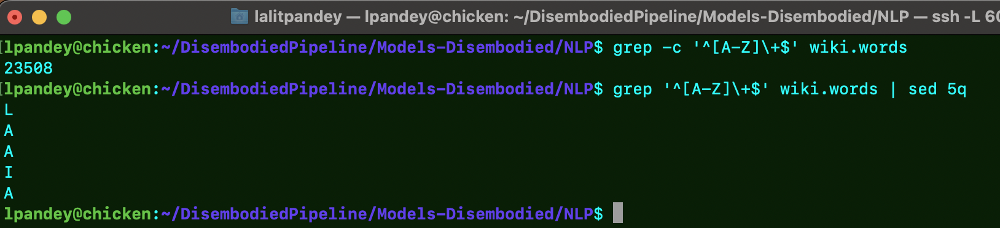
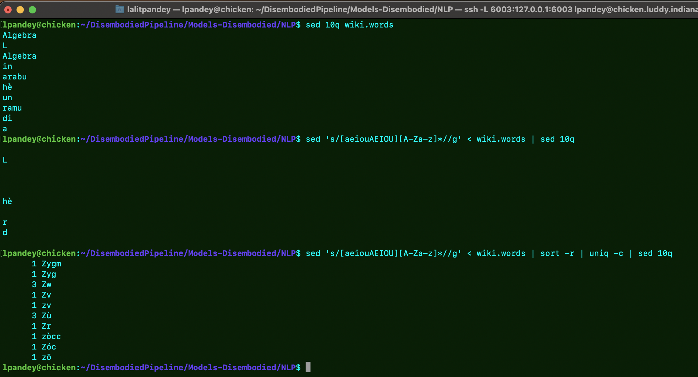

<center><h1>Practical - 00_Unix </h1></center>

<h3> I.Exercises with grep</h3>

<p><b> QUESTION1:</b> How many uppercase words are there in the Aragonese Wikipedia? Lowercase? Hint: wc -l or grep -c</p>

<p>Upper Case - </p>

``` grep -c '^[A-Z]\+$' wiki.words ```

<p>Lower Case - </p>

``` grep -c '^[a-z]\+$' wiki.words ```

<p><b>Output - </b></p>

</img>

<hr>

<p><b> QUESTION2:</b> How many 4-letter words?</p>


``` grep -i -c '^[A-Z][A-Z][A-Z][A-Z]$' wiki.words ```

<p><b>Output - </b></p>

</img>

<hr>

<p><b> QUESTION3:</b> Are there any words with no vowels?</p>

``` grep -i -c '^[^aeiou]$' wiki.words ```

<p><b>Output - </b></p>

</img>

<hr>

<p><b> QUESTION4:</b> Find ''1-syllable'' words (words with exactly one vowel)</p>

``` grep -i -c '^[^aeiou]*[aeiou][^aeiou]*$' wiki.words ```

<p><b>Output - </b></p>

</img>

<hr>

<p><b> QUESTION5:</b> Find ''2-syllable'' words (words with exactly two vowels)</p>

``` grep -i -c '^[^aeiou]*[aeiou][aeiou]*[^aeiou]*[aeiou]$' wiki.words ```

<p><b>Output - </b></p>

</img>

<hr>
<hr>

<h2> II.Exercises with sed</h2>

<p><b> QUESTION1:</b> Count word initial consonant sequences: tokenise by word, delete the vowel and the rest of the word, and count</p>

``` sed 's/[aeiouAEIOU][A-Za-z]*//g' < wiki.words > initial-consonents.hist```

<p><b> QUESTION2:</b> Count word final consonant sequences </p>

``` sed 's/[aeiouAEIOU][A-Za-z]*//g' < wiki.words | sort -r | uniq -c > final-consonents.hist```

<p><b>Output - </b></p>

</img>

<hr>