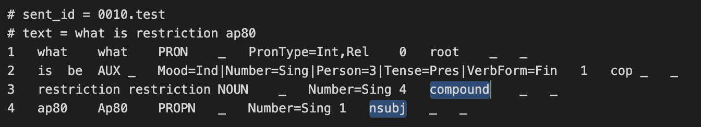
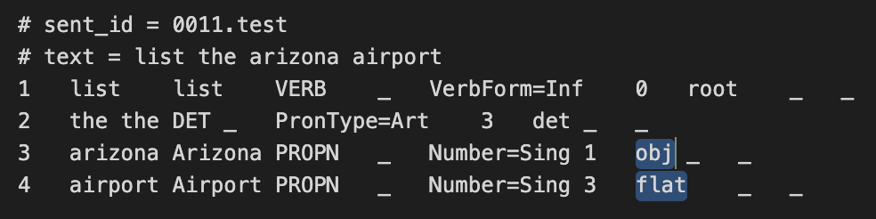
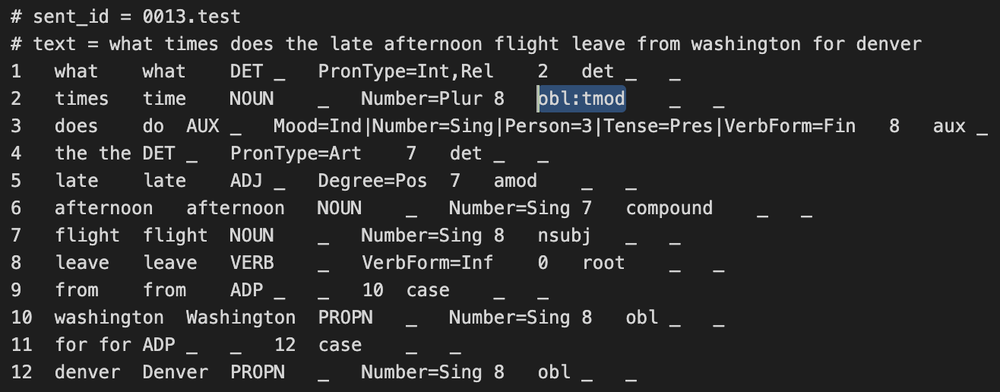
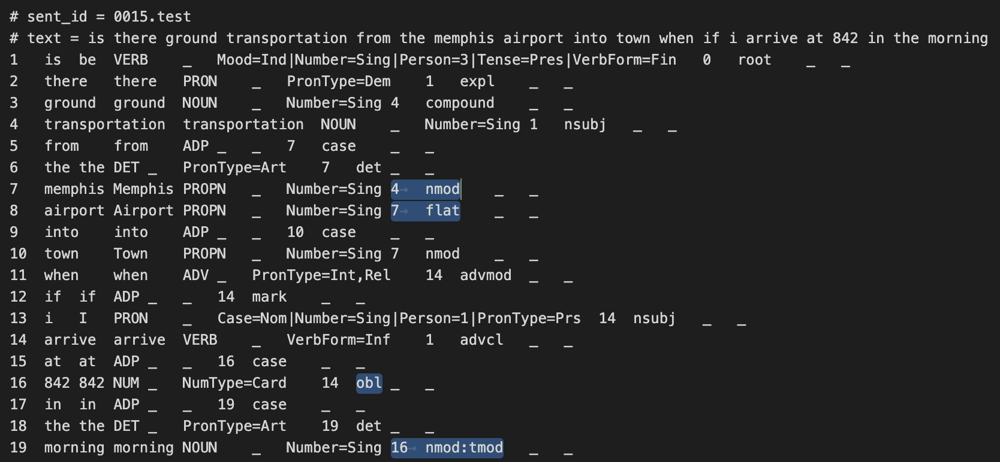
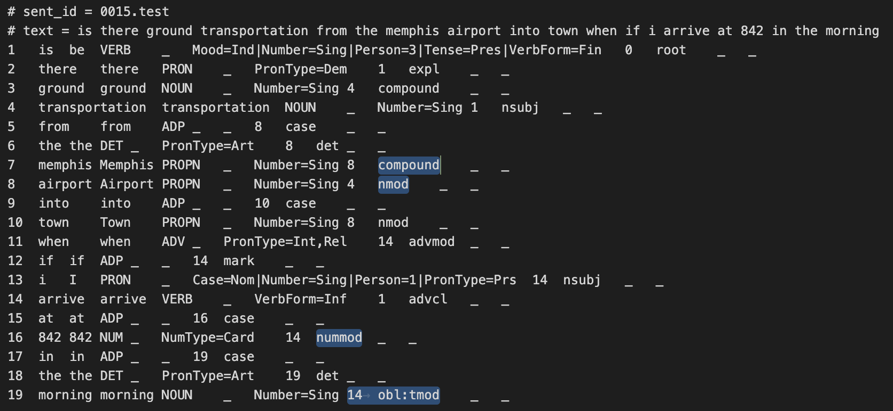
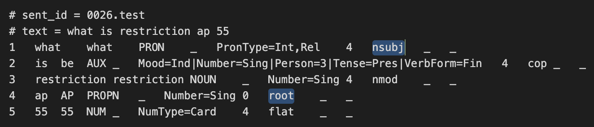
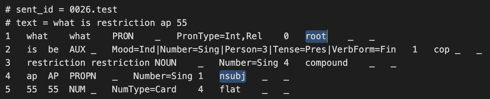
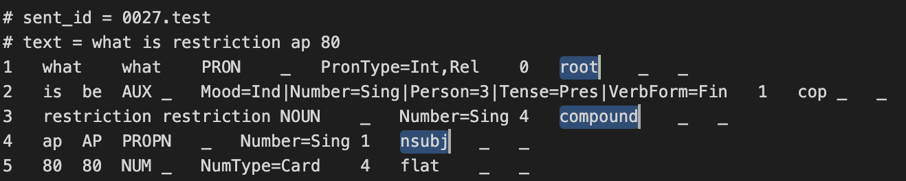
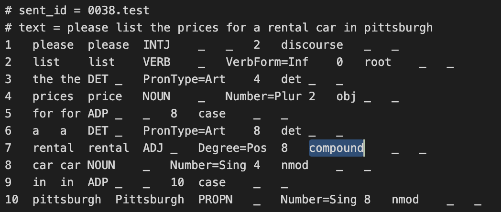
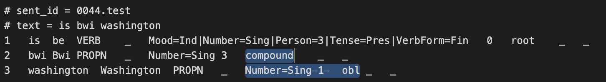

# Report

<table border="0">
 <tr>
    <td><b style="font-size:30px">TESTINGOUT.conllu</b></td>
    <td><b style="font-size:30px">test.conllu</b></td>
 </tr>
 <tr>
    <td></td>
    <td></td>
 </tr>
  <tr>
    <td></td>
    <td></td>
 </tr>
  <tr>
    <td></td>
    <td></td>
 </tr>
  <tr>
    <td></td>
    <td></td>
 </tr>
  <tr>
    <td></td>
    <td></td>
 </tr>
  <tr>
    <td></td>
    <td></td>
 </tr>
  <tr>
    <td></td>
    <td></td>
 </tr>
  <tr>
    <td></td>
    <td></td>
 </tr>
  <tr>
    <td></td>
    <td></td>
 </tr>
  <tr>
    <td></td>
    <td></td>
 </tr>
</table>

<h2>Performance </h2>

 

<h2>Observations </h2>

<ul>
<li>English language tree bank (en_atis-ud-train) was used to train and test the model.
<li>UAS and LAS dependecy scores are not 100% accurate.
<li>Based on the comparison from the table above, it is found that the model successfully identifies the Lemma, tenses, verbForm, person etc. However, many times the model fails to identify the 'root'. In many tree banks, 'nsubj' (nominal subject) is mistaken for 'root'.
<li> The model also fails to identify the 'compound' words which can be seen in row 4 in the above table.
<li> 'nmod' (nominal modifier) are mistaken for 'compound' words.
<li> The above errors are constantly repeated in a majority of tree banks. This indicates the reason for decline in the UAS and LAS scores.
</ul>

