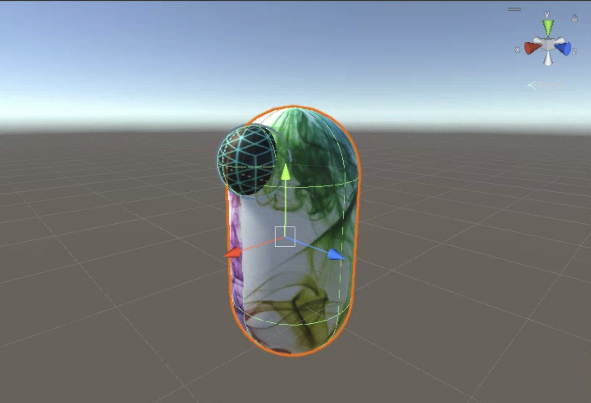

# Project

<h2>Project Description</h2>

Human language is a great tool to establish communication. If there existed a common medium such as language, between humans and machines, there would be endless opportunities. The objective of this project is to show how Natural language in the absence of reinforcement or imitation learning is sufficient to control the movement of a virtual agent in the 3D space. A novel architecture is introduced in this project. Using Attention-based network called Transformer (Bert) combined with our proposed parallel network training, we show that Attention based networks with NLP can solve kinematic task and can generate coordinates for the agent. 

<h2>Abstract</h2>

How far an attention-induced neural net- work can take us to perform a kine- matic robotic task with natural language instructions? Attention based networks such as Transformers can now solve var- ious complex problems. Due to their multi-modality, Transformers are used in many domains such as image processing, question-answering, text analysis, audio and video processing etc. A majority of language models make use of the atten- tion mechanism to understand the global and local relation between the tokens in a natural language. Despite their achiev- able higher accuracy and powerful atten- tion mechanism, recent research has not yet tested Transformers as the primary backbone to control robotic movements. A majority of research in robotics focuses on the use of reinforcement or imitation learning to train the agents. It is a common critique that reinforced agents generalize better to new environments. In this study, we validate this critique, introduce a kine- matic dataset and check the robustness of the Transformer on a novel task. In addi- tion, we also check whether simple natu- ral language instructions are sufficient to move/rotate an agent in a virtual environ- ment. We use a pre-trained attention net- work called Bert and train it on our custom dataset of natural language to generate 3D coordinates for our virtual agent. A paral- lel network training approach is also intro- duced in this paper while training the net- work on the downstream task. Our results suggest that natural language alone is suf- ficient to move a simple agent across the x, y and z axes in space.

<h2>Front End (Agent in Unity Engine)</h2>

Due to large file size, the zip file for the front end Unity Agent is hosted on the Google Drive. Link <a href="">here</a>

<h2>File Organization </h2>

<ul>
<li> NLP_Project.ipynb - notebook containing the backend code for the Language Model.
<li> instruction.txt - text file to pass instructions and coordinates between the front end (Unity) and back end (Language Model)
<li> NLP_Project_dataset_small.csv - contains dataset
</ul>

